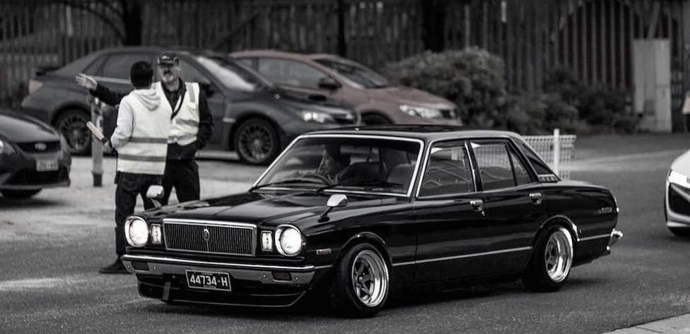

# Welcome

Documentation for modifying the HQ, HJ, HX, HZ, WB Holden Monaro, Kingswood, Sandman, Ute, Van and Commercial. Also referred to as the _'H Series'_.

The motivation for this site is to document **proven modifications.** All data has been crowdsourced and references have been provided.

Thank you to all who have contributed. The site is being updated on a best effort basis. Please contact [@ocampus](https://www.instagram.com/ocampus/) for any additions, amendments or feedback :pray:

---

## Updates

!!! success "Recently completed"
    - Site created

!!! example "Backlog"
    - Engine: Ignition
    - Engine: Alternator
    - Engine: Water pump
    - Engine: Headers
    - Cooling: Radiator

---
