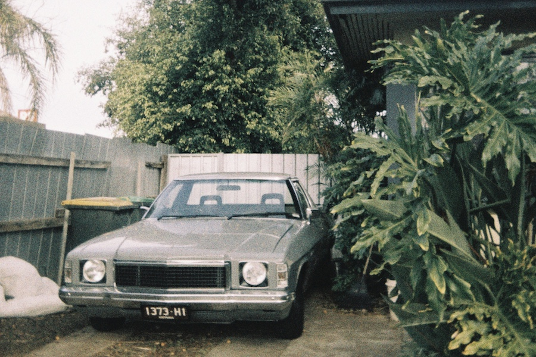

# Home

Documentation for modifying HQ, HJ, HX, HZ, WB Holdens. These are classified as the _['7th generation'](https://en.wikipedia.org/wiki/List_of_Holden_vehicles_by_series#Seventh_generation_(1971%E2%80%931984))_ but is most commonly referred to as _HQ-WB._

The motivation for this site is to document **proven modifications.** All data has been crowdsourced and references have been provided.

Thank you to all who have contributed. The site is being updated on a best effort basis. Please contact [@ocampus](https://www.instagram.com/ocampus/) for any additions, amendments or feedback :pray:

---

## Updates

!!! success "Recently completed"
    - Alternator
    - Starter

!!! example "Backlog"
    - Ignition

---
